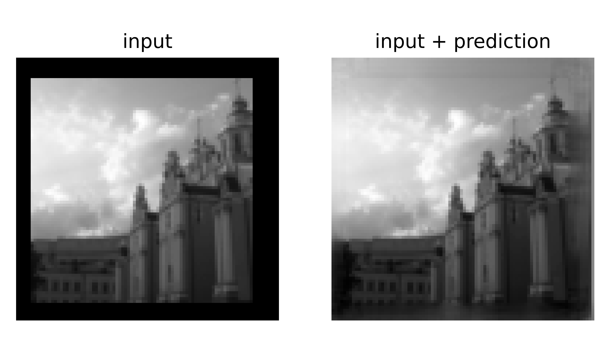

# Image extrapolation using Deep Learning

### Finale project of the course [Programming in Python II](https://studienhandbuch.jku.at/118028) at the Johannes Kepper Univerity Linz

The goal of the project was to create a _model_ using Convolutional Neural Networks which predicts unknown image pixels within specified borders. Below you see an example of such prediction. To the left is an image with unknown borders and to the right is an image with the pixels predicted by the model. Note that currently the input with unknown borders is created by cropping the images, but this set up could be relatively easily improved in order to achieve some practical application.

    

# Usage

There are two modes:  _predict_ and _train_. The first mode creates predictions for images stored in `./dataset/out/dataset.pkl`. The second mode performs model training using `./dataset/out/dataset.pkl` + `./dataset/out/targets.pkl`.

For both modes run following commands:

 `cd ./network`

 `python3 main.py working_config.json`

## Predict

Set the parameter `train` in the `working_config.json` to `0` (default). The output of the
folder `./network/results/predict` will consist of:

-   `plots`
-   `predictions.pkl`: predictions as 1D numpy array.

The default model used for predictions is `./model.pt` . You may change
  the path to the model in the variable `model` of the file  `./network/create_predictions.py`.

## Train

To perform training (and create your own model), set the parameter `train` in the `working_config.json` to `1`. The output is stored in
the folder `./network/results/train` and consists of:

-   `plots`
-   `tensorflow`: to see the _Data Flow Graphs_ run the following command `tensorboard --logdir results/ --port=6060` and
     open
    `local:6060` in the web-browser
-   `best_model.pt`: the best model from the last training
-   `indices.pkl`: indices used for splitting training, validation and test sets
-   `scores.txt`: scores of the test and validation loss

## Prediction Score

To get the score run:

-   `cd ./network/results/predict/`
-   `python3 ./scoring.py --submission predictions.pkl --target targets.pkl`

(you may manually copy the `targets.pkl` from `./dataset/out/` to `./network/results/predict/` if you changed the dataset before). The score of `0` would be a perfect prediction, but the scores around `-800` are quite good as well. To evaluate
your predictions you may check the plots manually.

## Dataset

 The provided dataset is an example only. In order to create your own dataset, put your image files into `./dataset/in`. Then run `cd ./dataset` and `python3 ./prepare_data.py`. Note that in order to get good training results you may have a quite large dataset and the training may last few hours.

## Requirements

The project was developed on _Ubuntu 20.1_ using CPU (not GPU) and uses among others following packages:

-   numpy, v1.20.2
-   torch, v1.8.1
-   dill, v0.3.3
-   matplotlib, v3.3.4
-   tqdm, v4.61.0
-   TensorFlow, v2.5.0
-   shutil

## Disclaimer

The project uses the [example project](https://github.com/widmi/programming-in-python/tree/master/Programming-in-Python-II/example_project) as skeleton as well as some code parts created by the course instructor, e. g. the functions

-   `./dataset/prepare_data.py/rgb2gray()`
-   `./dataset/prepare_data.py/reduce_image_sizes()`

Course materials can be found [here](https://github.com/widmi/programming-in-python).
